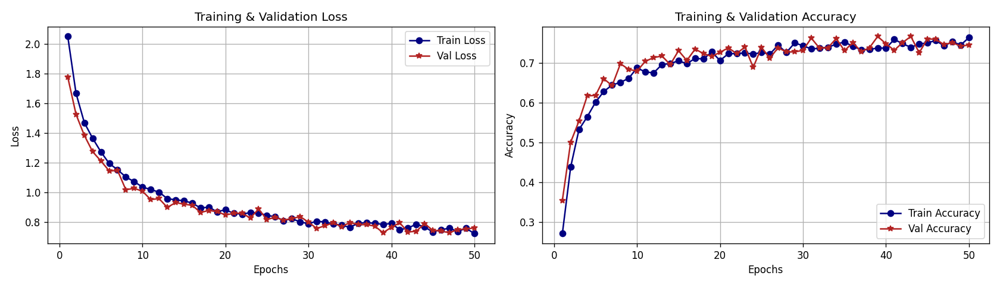
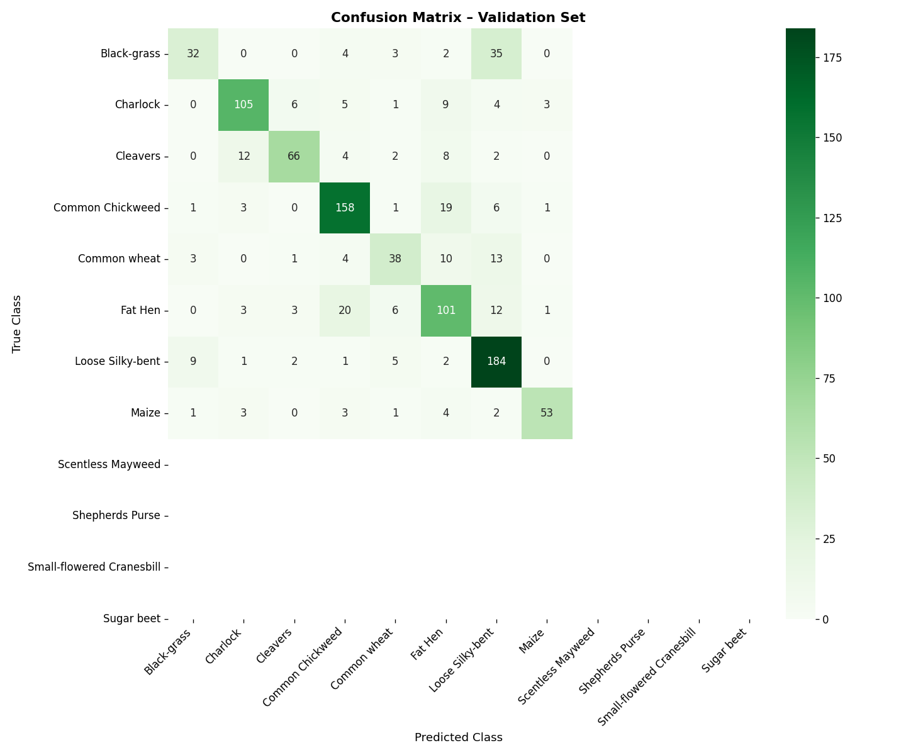

# 🌱 Plant Seedlings Classification using Deep CNN

[](https://www.python.org/)
[](https://pytorch.org/)
[](LICENSE)
[]()
[]()

> A Deep Learning based plant seedlings classification system using Transfer Learning with ResNet-18 architecture. The system classifies 12 different plant species (3 crops and 9 weeds) from images with a Tkinter-based GUI for real-time prediction.

---

## 📋 Table of Contents

- [Abstract](#abstract)
- [Project Overview](#project-overview)
- [Dataset](#dataset)
- [System Architecture](#system-architecture)
- [Technologies Used](#technologies-used)
- [Installation](#installation)
- [How to Run](#how-to-run)
- [Results](#results)
- [GUI Features](#gui-features)
- [Project Structure](#project-structure)
- [Requirements](#requirements)
- [Authors](#authors)

---

## 📄 Abstract

Agriculture plays a vital role in human existence and remains a key driver of many economies worldwide. One of the major challenges in precision farming is **early-stage weed identification** among crop seedlings. Manual identification is time-consuming, expensive, and prone to error.

This project presents a **Plant Seedlings Classification** system using **Deep Convolutional Neural Networks (CNN)**. We implement Transfer Learning using the **ResNet-18** architecture pre-trained on ImageNet and fine-tune it on the V2 Plant Seedlings Dataset containing approximately **5,000 images** across **12 plant species**.

The trained model achieved a **best validation accuracy of 76.58%** after 50 training epochs on CPU, demonstrating the feasibility of automated plant classification in agricultural applications.

---

## 🔍 Project Overview

Weed management is one of the key challenges in modern agriculture. Weeds compete with crops for nutrients, water, and sunlight — reducing crop yield significantly. Identifying weeds at the seedling stage allows for:

- **Early intervention** before weeds affect crop growth
- **Targeted herbicide application** reducing chemical usage
- **Automation** of weed detection using drones and robots
- **Cost reduction** in manual labor for weed removal

This system uses a **Graphical User Interface (GUI)** that allows users to upload any plant image and instantly get a prediction of the plant species along with confidence score.

---

## 🗂️ Dataset

| Property | Details |
|---|---|
| Source | [Kaggle - V2 Plant Seedlings Dataset](https://www.kaggle.com/vbookshelf/v2-plant-seedlings-dataset) |
| Total Images | ~5,000 |
| Total Classes | 12 |
| Image Formats | .jpg, .png, .jpeg |
| Train Split | 73% (~4,039 images) |
| Validation Split | 27% (~1,500 images) |

### 12 Plant Species:

| # | Class Name | Category |
|---|---|---|
| 1 | Black-grass | 🌿 Weed |
| 2 | Charlock | 🌿 Weed |
| 3 | Cleavers | 🌿 Weed |
| 4 | Common Chickweed | 🌿 Weed |
| 5 | Common wheat | 🌾 Crop |
| 6 | Fat Hen | 🌿 Weed |
| 7 | Loose Silky-bent | 🌿 Weed |
| 8 | Maize | 🌾 Crop |
| 9 | Scentless Mayweed | 🌿 Weed |
| 10 | Shepherds Purse | 🌿 Weed |
| 11 | Small-flowered Cranesbill | 🌿 Weed |
| 12 | Sugar beet | 🌾 Crop |

---

## 🏗️ System Architecture

```
Input Image
     │
     ▼
Pre-processing
(Resize 256 → CenterCrop 224 → Normalize)
     │
     ▼
ResNet-18 Backbone (Pre-trained on ImageNet)
[17 Frozen Layers — Feature Extractor]
     │
     ▼
Custom Fully Connected Layer
(512 → 12 classes)
     │
     ▼
Softmax Output
     │
     ▼
Predicted Class + Confidence Score
```

### Why ResNet-18?

**ResNet (Residual Network)** is a deep neural network architecture that introduced **skip connections** (also called residual connections) to solve the vanishing gradient problem in deep networks.

- **18** refers to the number of weighted layers in the network
- Skip connections allow gradients to flow directly through the network during backpropagation
- Pre-trained on **ImageNet** (1.2 million images, 1000 classes)
- Lightweight and efficient — suitable for CPU training

### Transfer Learning Approach

Instead of training from scratch, we used **Transfer Learning**:

1. Loaded ResNet-18 pre-trained weights from ImageNet
2. **Froze** all convolutional layers (feature extractor)
3. **Replaced** the final fully connected layer (1000 → 12 classes)
4. Trained **only the final layer** on our plant dataset
5. This reduced training time significantly while maintaining accuracy

---

## 💻 Technologies Used

| Technology | Version | Purpose |
|---|---|---|
| Python | 3.7+ | Programming Language |
| PyTorch | 1.8+ | Deep Learning Framework |
| TorchVision | 0.9+ | Image Transforms & Models |
| Tkinter | Built-in | GUI Development |
| Matplotlib | 3.4+ | Plotting Graphs |
| Seaborn | Latest | Confusion Matrix Heatmap |
| Scikit-learn | Latest | Metrics & Evaluation |
| NumPy | 1.19+ | Numerical Computing |
| Pillow | Latest | Image Processing |

---

## ⚙️ Installation

### Step 1 — Clone the repository

```bash
git clone https://github.com/varunkumarkesineni/plant-seedlings-classification.git
cd plant-seedlings-classification
```

### Step 2 — Install required libraries

```bash
pip install torch torchvision pillow matplotlib seaborn scikit-learn numpy
```

### Step 3 — Download the dataset

Download the V2 Plant Seedlings Dataset from Kaggle:
👉 https://www.kaggle.com/vbookshelf/v2-plant-seedlings-dataset

Extract and place it in the project folder:
```
plant-seedlings-classification/
└── dataset/
    └── train/
        ├── Black-grass/
        ├── Charlock/
        ├── Cleavers/
        ├── Common Chickweed/
        ├── Common wheat/
        ├── Fat Hen/
        ├── Loose Silky-bent/
        ├── Maize/
        ├── Scentless Mayweed/
        ├── Shepherds Purse/
        ├── Small-flowered Cranesbill/
        └── Sugar beet/
```

---

## ▶️ How to Run

### Step 1 — Train the Model

```bash
python plant_seedlings.py
```

- Training runs for **50 epochs**
- **Checkpoints** are saved every 5 epochs in `./checkpoints/` folder
- If training is interrupted, simply run the same command again — it will **automatically resume** from the last checkpoint
- After completion, the following files are saved:
  - `plant_model.pth` — trained model weights
  - `metrics.png` — training and validation graphs
  - `confusion_matrix.png` — confusion matrix heatmap

### Step 2 — Launch the GUI

```bash
python plant_gui.py
```

---

## 📊 Results

### Training Performance

| Metric | Value |
|---|---|
| Best Validation Accuracy | **76.58%** |
| Final Training Loss | 0.7223 |
| Final Validation Loss | 0.7621 |
| Total Epochs | 50 |
| Training Time | ~110 minutes (CPU) |
| Optimizer | SGD (lr=0.001, momentum=0.9) |
| Loss Function | Cross Entropy Loss |

### Accuracy Progression

| Epoch | Train Accuracy | Val Accuracy |
|---|---|---|
| 0 | 24.98% | 37.24% |
| 10 | 61.15% | 60.13% |
| 20 | 65.19% | 64.40% |
| 30 | 67.58% | 67.27% |
| 40 | 72.22% | 72.40% |
| 49 | 76.30% | **76.58%** |

### Training Graphs


### Confusion Matrix


---

## 🖥️ GUI Features

The application provides a clean and intuitive Tkinter-based interface with the following features:

| Feature | Description |
|---|---|
| 📂 Upload Image | Browse and load any plant image from your system |
| ⚡ Predict | Run inference and display predicted class with confidence % |
| 📊 Confusion Matrix | View the validation set confusion matrix heatmap |
| 📈 Training Graphs | View training and validation loss and accuracy curves |
| 🌿 All Classes | View all 12 plant species with Crop/Weed classification |
| 🔄 Clear | Reset the interface for a new prediction |

---

## 📁 Project Structure

```
plant-seedlings-classification/
│
├── plant_seedlings.py              ← Training script with checkpoint support
├── plant_gui.py                    ← Tkinter GUI application
├── requirements.txt                ← Required Python libraries
├── metrics.png                     ← Training & validation graphs
├── confusion_matrix.png            ← Confusion matrix heatmap
├── .gitignore                      ← Git ignore rules
├── README.md                       ← Project documentation
│
├── checkpoints/                    ← Auto-saved training checkpoints
│   └── checkpoint_epoch_X.pth
│
├── Plant Seedlings Classification/ ← Project documentation files
│   ├── 2023-V14I8072.pdf          ← Research paper reference
│   ├── DESIGN.docx
│   ├── Feasibility Analysis.docx
│   ├── HARDWARE AND SOFTWARE REQUIREMENT ANALYSIS.docx
│   ├── INPUT AND OUTPUT DESIGN.docx
│   ├── Non-functional requirement.docx
│   ├── Requirement specification.docx
│   ├── SOFTWARE ENVIRONMENT.doc
│   ├── SYSTEM SPECIFICATION.doc
│   ├── SYSTEM STUDY.doc
│   ├── SYSTEM TEST.docx
│   ├── Software Environment for Python.docx
│   ├── Software Model.docx
│   ├── System Requirement for Python.docx
│   └── TEST CASES.docx
```

---

## 📦 Requirements

```
torch
torchvision
pillow
matplotlib
seaborn
scikit-learn
numpy
```

Install all at once:
```bash
pip install torch torchvision pillow matplotlib seaborn scikit-learn numpy
```

---

## 🎓 Academic Information

| Field | Details |
|---|---|
| Institution | CMR College of Engineering and Technology (Autonomous) |
| Department | CSE |
| Project Type | Mini Project (2 Credits) |
| Reference Paper | Classification of Plant Seedlings Using Deep CNN Architectures — Journal of Engineering Sciences, Vol 14, Issue 08, 2023 |

---

## 📚 References

1. V2 Plant Seedlings Dataset — https://www.kaggle.com/vbookshelf/v2-plant-seedlings-dataset
2. He, K. et al. (2016) — Deep Residual Learning for Image Recognition
3. B. Hari Babu, Malli Chenchaiah — Classification of Plant Seedlings Using Deep CNN Architectures, Journal of Engineering Sciences, Vol 14 Issue 08, 2023
4. PyTorch Documentation — https://pytorch.org/docs/stable/index.html

---

## 👨‍💻 Authors

**Varun Kumar Kesineni**
- GitHub: [@varunkumarkesineni](https://github.com/varunkumarkesineni)
- Institution: CMR College of Engineering and Technology

---

## 📄 License

This project is licensed under the MIT License — feel free to use it for educational purposes.

---

⭐ If you found this project helpful, please give it a star on GitHub!
